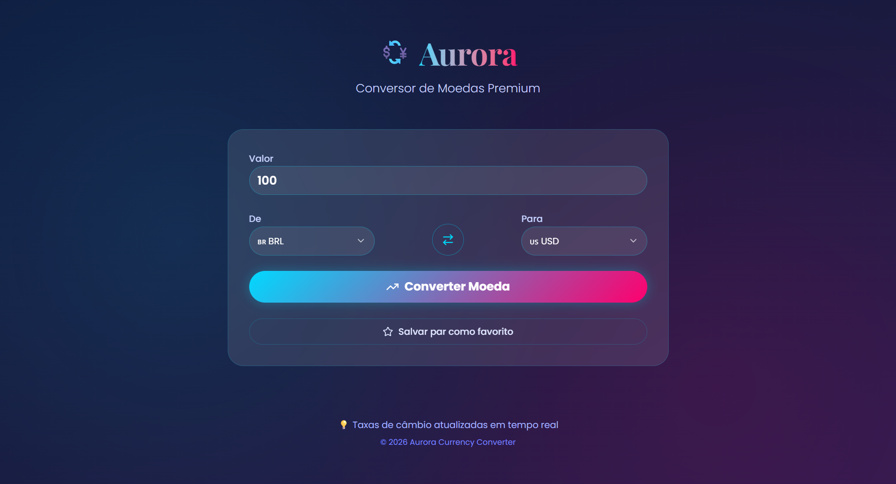
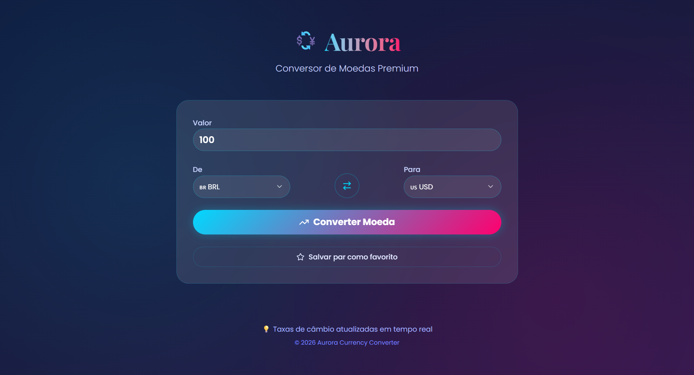
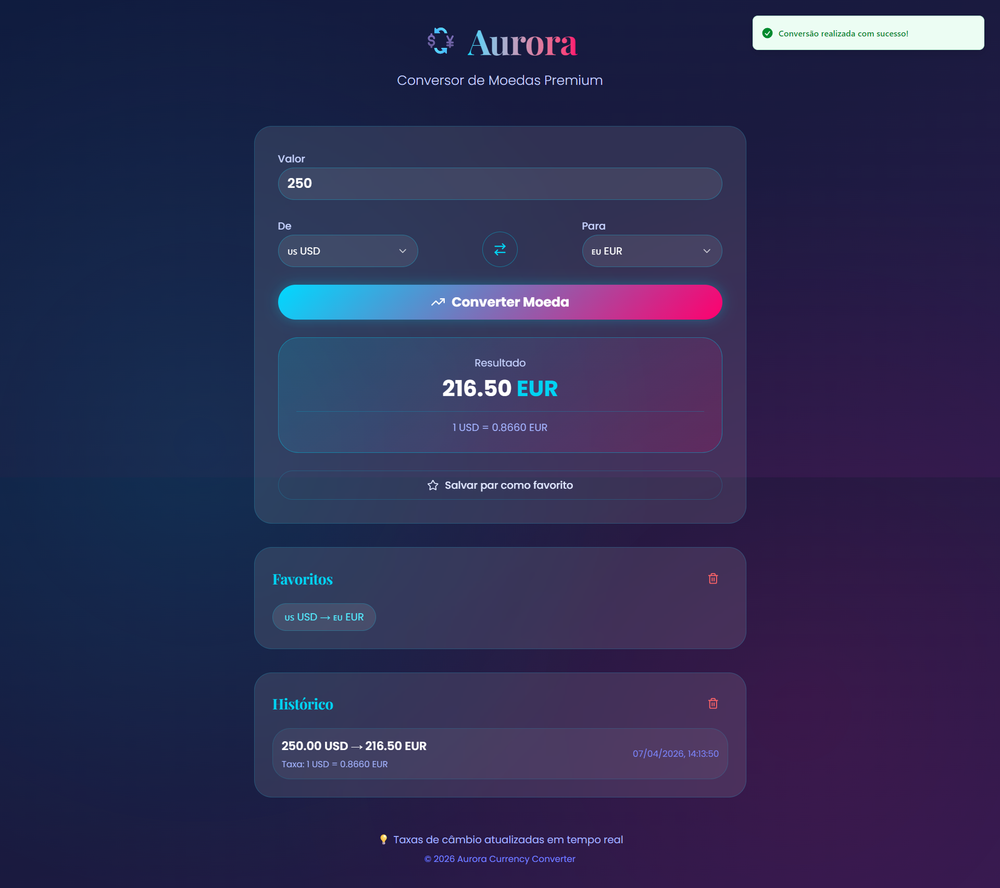

# 💱 Aurora Currency Converter

Aplicação web moderna para conversão de moedas em tempo real, com interface sofisticada, histórico de operações e foco em experiência do usuário.

---

## 🌐 Acesse o Projeto

👉 (adicione aqui o link do deploy quando publicar — Vercel recomendado)

---

## 📌 Objetivo do Projeto

Este projeto foi desenvolvido com o objetivo de praticar e demonstrar habilidades em desenvolvimento front-end moderno, incluindo:

* construção de interfaces sofisticadas e responsivas;
* desenvolvimento com React e TypeScript;
* consumo de APIs externas para dados em tempo real;
* gerenciamento de estado na aplicação;
* organização de código com boas práticas;
* aplicação de conceitos de UX/UI em sistemas reais.

---

## 🚀 Funcionalidades

* 💱 Conversão de moedas em tempo real
* 🌍 Suporte a múltiplas moedas (BRL, USD, EUR, etc.)
* 🔄 Inversão rápida entre moedas
* 📊 Histórico de conversões realizadas
* ⭐ Marcação de pares como favoritos
* 🎨 Interface moderna com design premium (glassmorphism + gradientes)
* ⚡ Alta performance com Vite
* 📱 Layout totalmente responsivo

---

## 🛠️ Tecnologias Utilizadas

* React
* TypeScript
* Vite
* Tailwind CSS
* Radix UI
* Wouter (roteamento leve)
* Lucide Icons
* API de câmbio (exchange rates)

---

## 🏗️ Estrutura do Projeto

```
aurora-currency-converter/
│
├── public/                # Arquivos públicos (favicon, etc.)
├── src/
│   ├── components/        # Componentes reutilizáveis
│   │   ├── ui/            # Componentes de interface (botões, inputs, etc.)
│   │   └── ErrorBoundary.tsx
│   ├── contexts/          # Contextos globais (tema, etc.)
│   ├── lib/               # Funções utilitárias
│   ├── pages/             # Páginas da aplicação
│   │   ├── Home.tsx
│   │   └── NotFound.tsx
│   ├── App.tsx            # Componente principal
│   ├── main.tsx           # Entry point da aplicação
│   └── index.css          # Estilos globais
│
├── index.html             # Template HTML
├── package.json           # Dependências e scripts
├── vite.config.ts         # Configuração do Vite
└── tsconfig.json          # Configuração TypeScript
```

---

## ⚙️ Organização da Aplicação

A aplicação foi estruturada seguindo boas práticas modernas:

* **Componentização (React):** reutilização de componentes e separação de responsabilidades;
* **TypeScript:** tipagem estática para maior segurança e escalabilidade;
* **Estilização (Tailwind):** construção de layouts modernos e consistentes;
* **Context API:** gerenciamento de estado global (tema);
* **Separação por camadas:** organização entre páginas, componentes, contextos e utilitários.

---

## ⭐ Diferenciais Técnicos

* Consumo de API externa para dados em tempo real
* Interface moderna com glassmorphism e gradientes
* Estrutura escalável baseada em componentes
* Uso de TypeScript para maior robustez
* Organização profissional de pastas
* Histórico de operações integrado à UI
* Código limpo e de fácil manutenção

---

## 📸 Interface do Sistema

### 🏠 Página Principal

<p align="center">
  
</p>

### 💱 Conversão

<p align="center">
  
</p>

### 📊 Histórico

<p align="center">
  
</p>

---

## ▶️ Como Executar o Projeto

### 1. Clonar o repositório

```bash
git clone https://github.com/seu-usuario/aurora-currency-converter.git
```

### 2. Acessar a pasta do projeto

```bash
cd aurora-currency-converter
```

### 3. Instalar dependências

```bash
npm install
```

### 4. Executar o projeto

```bash
npm run dev
```

---

## ⚠️ Observações

* A conversão depende de API externa de câmbio
* É necessário acesso à internet para funcionamento completo
* Valores podem variar de acordo com a cotação em tempo real

---

## 🧠 Decisões de Desenvolvimento

Durante o desenvolvimento deste projeto, foram adotadas algumas decisões técnicas importantes:

* **Uso de React + TypeScript:** para garantir escalabilidade, organização e segurança no código;
* **Vite como bundler:** visando alta performance e tempo de build reduzido;
* **Tailwind CSS:** para criação rápida de layouts modernos e consistentes;
* **Arquitetura baseada em componentes:** facilitando reutilização e manutenção;
* **Consumo de API externa:** para obtenção de dados de câmbio atualizados;
* **Histórico de conversões:** para melhorar a experiência do usuário;
* **Interface premium:** aplicação de conceitos visuais modernos (gradientes, glassmorphism);
* **Separação de responsabilidades:** organização clara entre UI, lógica e dados.

---

## 📈 Melhorias Futuras

* 📊 Gráficos de variação cambial
* 🌙 Alternância entre tema claro/escuro
* 🔔 Alertas de preço de moedas
* 🌍 Detecção automática de localização
* 💾 Persistência de dados com backend
* 🔐 Sistema de autenticação

---

## 📄 Licença

Este projeto está sob a licença MIT.

---

## 👨‍💻 Autor

**Felipe França**

