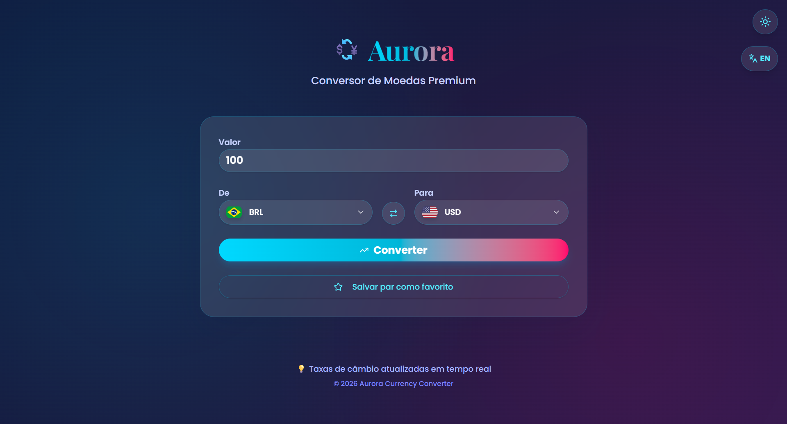
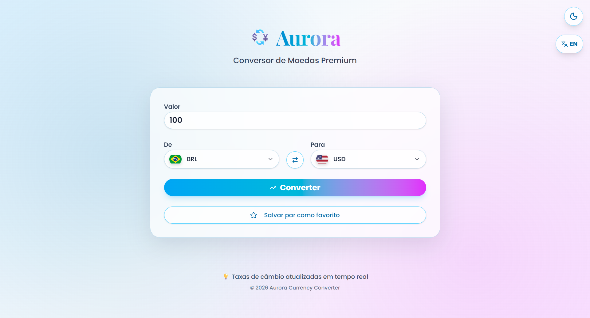
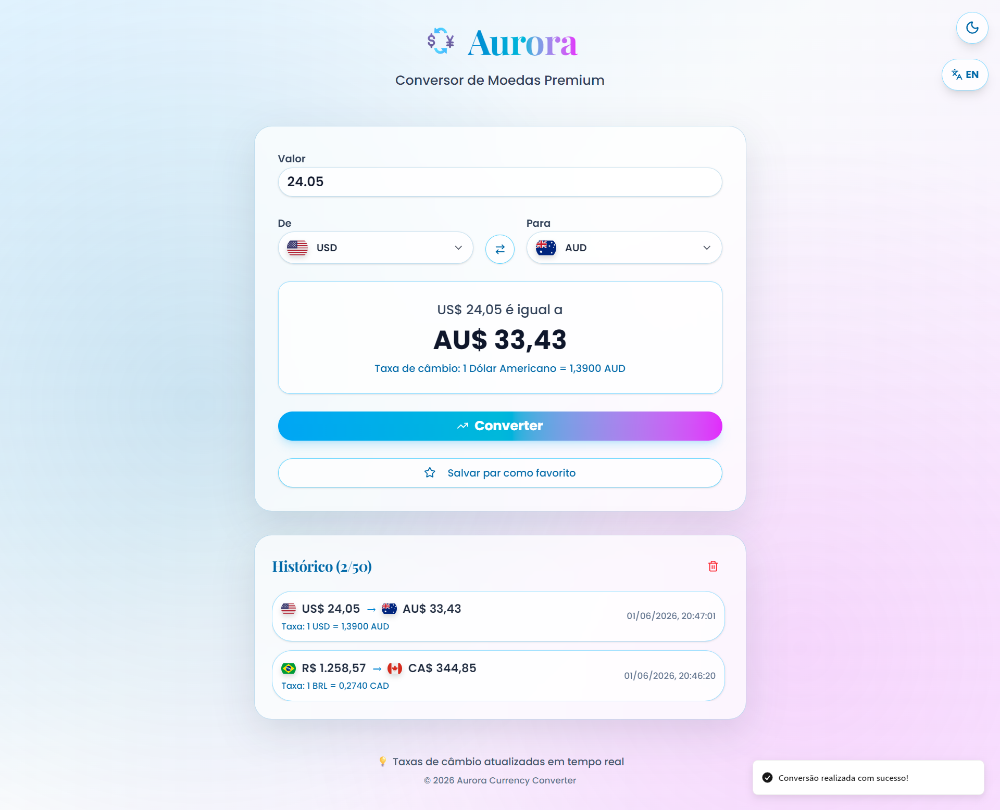
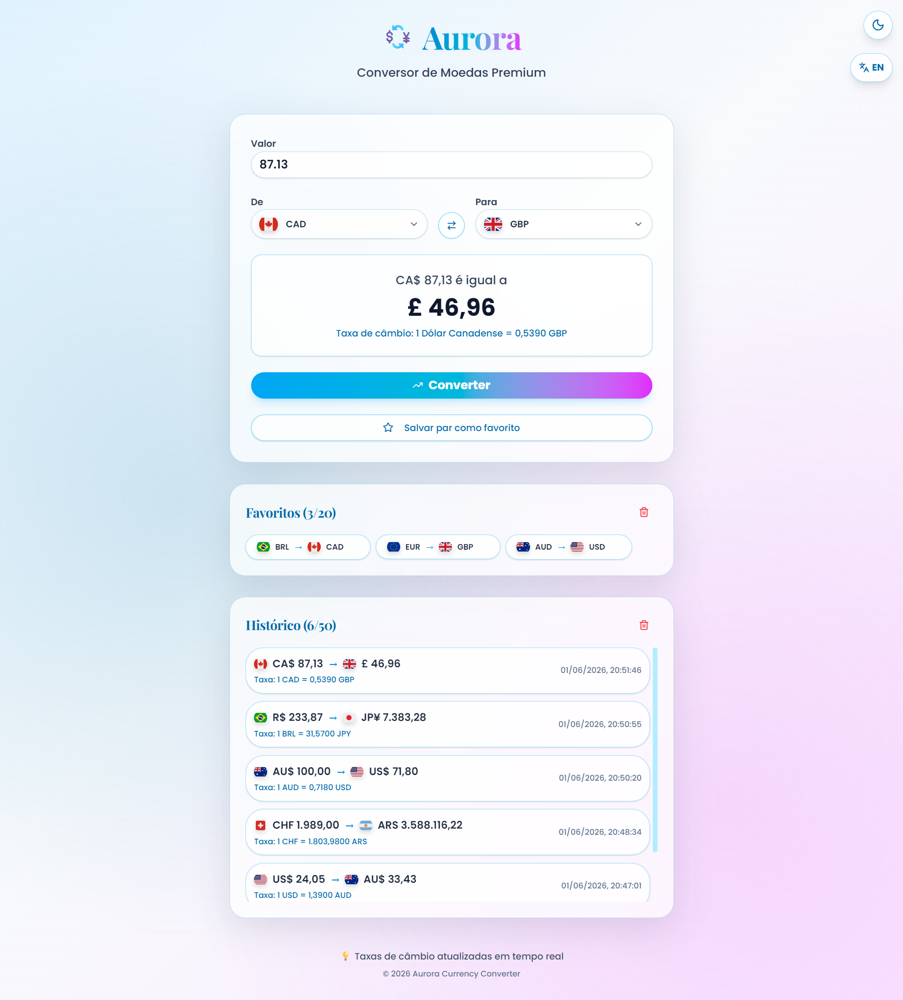

[](https://github.com/felipe-frc/aurora-currency-converter/actions/workflows/frontend-ci.yml)


# 💱 Aurora Currency Converter

Aplicação front-end desenvolvida com **React 19**, **TypeScript**, **Vite** e **Tailwind CSS**, criada para demonstrar práticas de engenharia de software aplicadas a uma interface real: separação de responsabilidades, custom hooks, integração resiliente com API externa, internacionalização, persistência local, testes automatizados, testes E2E e integração contínua.

Embora o domínio seja um conversor de moedas, o foco técnico do projeto está na construção de uma base front-end organizada, tipada e testável. A lógica principal foi isolada em hooks e services, o estado compartilhado utiliza Context API, a interface possui suporte a **pt-BR e en-US**, e o pipeline de CI valida lint, tipagem, testes com cobertura, testes E2E com Playwright e build de produção.

---

## 🌐 Acesse o Projeto

🔗 **Deploy:** [aurora-currency-converter.vercel.app](https://aurora-currency-converter.vercel.app/)

📂 **Repositório:** [github.com/felipe-frc/aurora-currency-converter](https://github.com/felipe-frc/aurora-currency-converter)

A aplicação está publicada na **Vercel** com deploy automatizado a cada atualização enviada para a branch `main`.

---

## 📌 Objetivo do Projeto

Este projeto foi desenvolvido com o objetivo de praticar e demonstrar conhecimentos em:

- Desenvolvimento front-end moderno com React e TypeScript;
- Arquitetura de componentes e separação de responsabilidades;
- Criação de custom hooks reutilizáveis;
- Gerenciamento de estado compartilhado com Context API;
- Internacionalização com suporte a `pt-BR` e `en-US`;
- Integração resiliente com API externa;
- Tratamento tipado de erros, timeout e cancelamento de requisições;
- Persistência e validação de dados no `localStorage`;
- Tema claro/escuro com persistência da preferência do usuário;
- Testes unitários e de integração com Vitest e Testing Library;
- Testes E2E com Playwright em Chromium;
- Mock de API externa em testes automatizados;
- Cobertura de testes com Vitest Coverage V8;
- Lint, verificação de tipos, testes e build automatizados;
- Integração contínua com GitHub Actions;
- Deploy automatizado com Vercel;
- Organização profissional de código e documentação para portfólio.

---

## ⭐ Destaques de Engenharia

- Lógica principal de conversão centralizada no custom hook `useCurrencyConverter`;
- Hook genérico `useLocalStorage` com validação dos dados persistidos;
- Camada de serviço dedicada para integração com a API de câmbio;
- Erros de integração modelados por códigos tipados e tratados de forma específica;
- Tratamento de `404`, `429`, respostas inválidas, taxa inválida e indisponibilidade de rede;
- Cancelamento de requisições concorrentes com `AbortController`;
- Timeout configurável para chamadas à API externa;
- Otimização para conversões entre a mesma moeda sem requisição desnecessária;
- Internacionalização própria com suporte a `pt-BR` e `en-US`;
- Context API para gerenciamento global de idioma e tema;
- Persistência de idioma, tema, favoritos e histórico no navegador;
- Testes unitários e de integração com Vitest e Testing Library;
- Testes E2E com Playwright executados em Chromium;
- API externa mockada também no fluxo E2E de conversão;
- Relatório HTML do Playwright com screenshot, vídeo e trace em cenários de falha;
- Cobertura de testes com provider V8 e thresholds mínimos;
- Pipeline de CI executando lint, type-check, cobertura, build e testes E2E;
- TypeScript utilizado para modelagem de domínio, contratos e estados da aplicação.

---

## 🚀 Funcionalidades

### 💱 Conversão

- Conversão de moedas com cotações atualizadas via API externa;
- Suporte a múltiplas moedas, incluindo BRL, USD, EUR, GBP, JPY, CAD, AUD, CHF, CNY e ARS;
- Inversão rápida entre moeda de origem e moeda de destino;
- Exibição de bandeiras para identificação visual das moedas;
- Resultado formatado com `Intl.NumberFormat`;
- Exibição da taxa de câmbio utilizada na conversão;
- Tratamento de erros de rede, resposta inválida, moeda não suportada e indisponibilidade da API.

### ⭐ Favoritos

- Marcação de pares de moedas como favoritos;
- Acesso rápido aos pares mais usados;
- Limite controlado de favoritos;
- Validação para impedir favoritos duplicados;
- Persistência dos favoritos no `localStorage`;
- Remoção individual de favoritos;
- Limpeza completa da lista de favoritos.

### 📊 Histórico

- Registro automático das conversões realizadas;
- Exibição do valor original, valor convertido, taxa utilizada e horário da operação;
- Histórico formatado com padrão brasileiro de data e hora;
- Limite controlado de registros;
- Persistência do histórico no `localStorage`;
- Limpeza completa do histórico.

### 🌗 Tema claro/escuro

- Alternância real entre tema claro e tema escuro;
- Botão visual para troca de tema;
- Persistência da preferência do usuário no `localStorage`;
- Aplicação das classes `dark` e `light` no `document.documentElement`;
- Tema claro com fundo suave, cards destacados, bordas visíveis e melhor contraste;
- Tema escuro mantendo a identidade visual neon/glassmorphism do projeto.

### 🌎 Internacionalização

- Interface disponível em português (`pt-BR`) e inglês (`en-US`);
- Troca de idioma em tempo de execução;
- Persistência do idioma selecionado no `localStorage`;
- Atualização do atributo `lang` do documento;
- Textos centralizados em `src/i18n/translations.ts`;
- Context API e hook `useLanguage` para consumo das traduções;
- Testes específicos para contexto, hook e `LanguageToggle`.

### 🎨 Interface

- Design moderno com glassmorphism, gradientes e elementos translúcidos;
- Layout responsivo para mobile e desktop;
- Selects customizados com Radix UI;
- Notificações toast com Sonner;
- Feedback visual para carregamento, erros e ações concluídas;
- Botões, cards, inputs e listas com foco em legibilidade e usabilidade.

### 🧪 Testes automatizados

- Testes de renderização da tela principal;
- Testes de conversão com API mockada;
- Testes de favoritos;
- Testes de carregamento de histórico salvo no `localStorage`;
- Testes de validação para valor inválido;
- Testes de tratamento de erro da API;
- Testes do service de câmbio;
- Testes do hook `useCurrencyConverter`;
- Testes do hook `useLocalStorage`;
- Testes dos helpers de formatação monetária;
- Testes dos hooks `useLanguage` e `useTheme`;
- Testes do `LanguageToggle`;
- Testes do `ThemeProvider`, `useTheme` e `ThemeToggle`;
- Testes E2E de carregamento, preenchimento, tema, idioma e conversão;
- Relatório de cobertura com Vitest Coverage V8;
- Execução automática dos testes no pipeline de CI.

---

## 🛠️ Tecnologias

| Camada                      | Tecnologia               |
| --------------------------- | ------------------------ |
| Linguagem                   | TypeScript               |
| Biblioteca                  | React                    |
| Bundler                     | Vite                     |
| Estilização                 | Tailwind CSS             |
| Componentes acessíveis      | Radix UI                 |
| Roteamento                  | Wouter                   |
| Ícones                      | Lucide React             |
| Notificações                | Sonner                   |
| Testes unitários/integrados | Vitest + Testing Library |
| Testes E2E                  | Playwright               |
| Navegador E2E               | Chromium                 |
| Cobertura                   | Vitest Coverage V8       |
| Ambiente de testes          | jsdom                    |
| Linting                     | ESLint                   |
| CI/CD                       | GitHub Actions           |
| Deploy                      | Vercel                   |
| Versionamento               | Git / GitHub             |

---

## 🏗️ Estrutura do Projeto

```txt
aurora-currency-converter/
│
├── .github/
│   └── workflows/
│       └── frontend-ci.yml              # Pipeline de validação do front-end e E2E
│
├── docs/
│   └── images/                          # Imagens utilizadas na documentação
│       ├── conversion.png
│       ├── dark-theme.png
│       ├── history.png
│       ├── home.png
│       └── light-theme.png
│
├── e2e/
│   └── aurora.spec.ts                   # Fluxos E2E executados com Playwright
│
├── public/                               # Arquivos públicos
│
├── src/
│   ├── components/
│   │   ├── currency/                    # Componentes do domínio de conversão
│   │   │   ├── CurrencyResult.tsx
│   │   │   ├── CurrencySelect.tsx
│   │   │   ├── FavoritesList.tsx
│   │   │   ├── FlagImage.tsx
│   │   │   └── HistoryList.tsx
│   │   │
│   │   ├── language/                    # Controle de idioma
│   │   │   ├── LanguageToggle.tsx
│   │   │   └── LanguageToggle.test.tsx
│   │   │
│   │   ├── theme/                       # Controle de tema
│   │   │   ├── ThemeToggle.tsx
│   │   │   └── ThemeToggle.test.tsx
│   │   │
│   │   ├── ui/                          # Componentes base de interface
│   │   │   ├── button.tsx
│   │   │   ├── card.tsx
│   │   │   ├── input.tsx
│   │   │   ├── select.tsx
│   │   │   └── sonner.tsx
│   │   │
│   │   └── ErrorBoundary.tsx            # Tratamento de erro em componentes React
│   │
│   ├── contexts/                        # Estado compartilhado da aplicação
│   │   ├── LanguageContext.tsx
│   │   ├── ThemeContext.tsx
│   │   ├── ThemeContext.test.tsx
│   │   ├── language.ts
│   │   ├── theme.ts
│   │   ├── useLanguage.ts
│   │   ├── useLanguage.test.tsx
│   │   ├── useTheme.ts
│   │   └── useTheme.test.tsx
│   │
│   ├── data/
│   │   └── currencies.ts                # Lista de moedas e helpers
│   │
│   ├── hooks/
│   │   ├── useCurrencyConverter.ts      # Orquestra regras e estado do conversor
│   │   ├── useCurrencyConverter.test.tsx
│   │   ├── useLocalStorage.ts           # Persistência reutilizável
│   │   └── useLocalStorage.test.tsx
│   │
│   ├── i18n/
│   │   └── translations.ts              # Textos pt-BR/en-US e tipos de tradução
│   │
│   ├── lib/
│   │   └── utils.ts                     # Utilitário para composição de classes
│   │
│   ├── pages/
│   │   ├── Home.tsx                     # Página principal
│   │   └── NotFound.tsx                 # Página 404
│   │
│   ├── services/
│   │   ├── exchangeService.ts           # Integração resiliente com API de câmbio
│   │   └── exchangeService.test.ts
│   │
│   ├── test/
│   │   ├── Home.test.tsx                # Testes da experiência principal
│   │   └── setup.ts                     # Setup global dos testes
│   │
│   ├── types/
│   │   └── currency.ts                  # Tipos do domínio
│   │
│   ├── utils/
│   │   ├── formatCurrency.ts            # Helpers de formatação monetária
│   │   └── formatCurrency.test.ts
│   │
│   ├── App.tsx                          # Rotas e providers globais
│   ├── index.css                        # Estilos globais, variáveis e temas
│   ├── main.tsx                         # Entry point
│   └── vite-env.d.ts                    # Tipagens do Vite
│
├── .env.example                         # Exemplo de configuração da API
├── .gitignore
├── eslint.config.js
├── index.html
├── LICENSE
├── package.json
├── package-lock.json
├── playwright.config.ts                 # Configuração dos testes E2E
├── tsconfig.app.json
├── tsconfig.json
├── tsconfig.node.json
└── vite.config.ts
```

---

## 📸 Interface do Sistema

### 🏠 Página Principal

Tela inicial do Aurora Currency Converter com o conversor centralizado, seleção de moedas com bandeiras, alternância de tema e acesso ao histórico e favoritos.


---

### 🌙 Tema Escuro

Interface principal no tema escuro, mantendo a identidade visual neon/glassmorphism do projeto.



---

### ☀️ Tema Claro

Interface principal no tema claro, com contraste ajustado, cards destacados e melhor legibilidade.



---

### 💱 Conversão de Moedas

Resultado da conversão com cotação atualizada, exibição do par de moedas, taxa de câmbio utilizada e botão de inversão rápida.



---

### 📊 Histórico de Conversões

Painel de histórico com o registro das conversões realizadas, incluindo par de moedas, valor convertido, taxa utilizada e horário da operação.



---

## ⚙️ Como Executar o Projeto

### Pré-requisitos

- Node.js 20 ou superior;
- npm;
- Git instalado.

---

### 1. Clone o repositório

```bash
git clone https://github.com/felipe-frc/aurora-currency-converter.git
```

---

### 2. Acesse a pasta do projeto

```bash
cd aurora-currency-converter
```

---

### 3. Instale as dependências

Para instalação reprodutível usando o `package-lock.json`:

```bash
npm ci
```

Ou, se preferir instalar de forma tradicional durante o desenvolvimento:

```bash
npm install
```

---

### 4. Configure as variáveis de ambiente

Crie um arquivo `.env` na raiz do projeto com base no arquivo `.env.example`.

No Windows:

```bash
copy .env.example .env
```

No Linux/macOS:

```bash
cp .env.example .env
```

O arquivo `.env` deve conter:

```env
VITE_EXCHANGE_API_URL=https://api.exchangerate-api.com/v4/latest
```

> A API utilizada nesta versão não exige chave de autenticação. A variável acima permite configurar a URL base da API de câmbio usada pela aplicação.

---

### 5. Execute o projeto em modo de desenvolvimento

```bash
npm run dev
```

Após iniciar, o terminal exibirá uma URL parecida com:

```txt
VITE ready in Xms
➜  Local:   http://localhost:5173/
```

Abra essa URL no navegador:

```txt
http://localhost:5173
```

---

### 6. Gere o build de produção

```bash
npm run build
```

---

### 7. Execute o lint

```bash
npm run lint
```

---

### 8. Execute a verificação de tipos

```bash
npm run type-check
```

---

### 9. Execute os testes com Vitest

Para executar os testes uma única vez:

```bash
npm run test:run
```

Para executar os testes em modo observação durante o desenvolvimento:

```bash
npm run test
```

Para executar os testes com relatório de cobertura:

```bash
npm run test:coverage
```

---

### 10. Execute os testes E2E com Playwright

Na primeira execução, instale o Chromium gerenciado pelo Playwright:

```bash
npx playwright install chromium
```

Execute os testes E2E:

```bash
npm run test:e2e
```

Para abrir a interface interativa do Playwright:

```bash
npm run test:e2e:ui
```

Para visualizar o último relatório HTML:

```bash
npm run test:e2e:report
```

---

## 🧪 Testes Automatizados

O projeto possui duas camadas complementares de testes: **Vitest + Testing Library** para testes unitários e de integração e **Playwright** para validação E2E em navegador.

### Vitest + Testing Library

A suíte utiliza **jsdom** e **Vitest Coverage V8** e cobre:

- Renderização da tela principal do conversor;
- Conversão de moedas com retorno de API mockado;
- Verificação das chamadas realizadas para a API de câmbio;
- Exibição do resultado e da taxa de câmbio;
- Registro de conversões no histórico;
- Salvamento e remoção de favoritos;
- Carregamento de dados persistidos no `localStorage`;
- Validação para impedir conversões com valor inválido;
- Tratamento de falhas da API;
- Service `fetchExchangeRate`, incluindo cenários de erro;
- Hook `useCurrencyConverter`;
- Hook `useLocalStorage`;
- Helpers `formatCurrency` e `formatExchangeRate`;
- `LanguageProvider`, hook `useLanguage` e `LanguageToggle`;
- `ThemeProvider`, hook `useTheme` e `ThemeToggle`.

A configuração está integrada ao Vite por meio do `vite.config.ts`. A pasta `e2e/` é excluída da descoberta do Vitest para manter a suíte unitária/integrada separada da suíte Playwright.

O relatório de cobertura pode ser gerado com:

```bash
npm run test:coverage
```

Os thresholds mínimos configurados são:

| Métrica    | Mínimo |
| ---------- | -----: |
| Lines      |    80% |
| Functions  |    75% |
| Statements |    80% |
| Branches   |    70% |

O diretório `coverage/` é gerado localmente e não deve ser versionado no repositório.

### Playwright E2E

Os testes E2E estão em `e2e/aurora.spec.ts` e são executados em **Chromium**.

A suíte valida os principais fluxos de ponta a ponta:

- Carregamento correto da aplicação;
- Preenchimento do valor da conversão;
- Troca entre tema claro e escuro;
- Troca de idioma;
- Conversão de moeda com resposta controlada da API por meio de mock de rede.

O fluxo de conversão E2E intercepta a chamada da API externa para tornar o teste determinístico e independente da disponibilidade ou da cotação real do serviço.

O `playwright.config.ts` também está configurado para:

- Executar testes em paralelo localmente;
- Utilizar uma única worker no CI;
- Fazer retries no ambiente de CI;
- Gerar trace na primeira repetição após falha;
- Capturar screenshot somente em falhas;
- Reter vídeo quando houver falha;
- Gerar relatório HTML em `playwright-report/`;
- Inicializar automaticamente o preview do Vite em `http://127.0.0.1:4173`.

Os diretórios `playwright-report/`, `test-results/` e `blob-report/` são artefatos locais e permanecem fora do versionamento.

---

## 🔁 CI/CD

O projeto possui pipeline de integração contínua com **GitHub Actions**.

A cada `push` ou `pull_request` para a branch `main`, o workflow executa:

```bash
npm ci
npm run lint
npm run type-check
npm run test:coverage
npm run build
npx playwright install --with-deps chromium
npx playwright test
```

Esse fluxo garante que lint, tipagem, testes unitários/integrados, thresholds de cobertura, build de produção e testes E2E estejam funcionando antes da validação do pipeline.

O workflow publica:

- O relatório de cobertura como artifact;
- O relatório HTML do Playwright como artifact, inclusive quando os testes E2E falham.

Isso permite analisar evidências de falha diretamente pelo GitHub Actions sem versionar os diretórios gerados localmente.

---

## ⚠️ Observações

- A conversão em produção depende de uma API externa de câmbio;
- É necessário acesso à internet para o funcionamento completo da aplicação;
- Os valores exibidos refletem as cotações atualizadas fornecidas pela API externa;
- O histórico, favoritos, idioma e tema são persistidos no `localStorage`;
- A URL base da API pode ser configurada pela variável `VITE_EXCHANGE_API_URL`;
- O arquivo `.env.example` serve como modelo para configuração local do projeto;
- Os testes Vitest utilizam mocks para validar comportamentos sem depender da API externa em tempo real;
- O teste E2E de conversão também utiliza interceptação de rede para manter o cenário previsível;
- O Playwright utiliza Chromium gerenciado pela própria ferramenta, independentemente do navegador principal instalado pelo desenvolvedor;
- `coverage/`, `playwright-report/`, `test-results/` e `blob-report/` devem permanecer fora do versionamento.

---

## 🧠 Decisões de Desenvolvimento

### React + TypeScript

O uso de React com TypeScript garante tipagem estática em toda a aplicação, reduzindo erros em tempo de execução e tornando o código mais seguro, escalável e fácil de manter.

### Vite como bundler

O Vite foi adotado como ferramenta de build por oferecer tempo de inicialização rápido, suporte moderno a TypeScript e integração simples com Vitest.

### Tailwind CSS + Radix UI

A combinação de Tailwind CSS com Radix UI permite construir uma interface estilizada, responsiva e acessível. O Radix UI fornece a base comportamental dos componentes, enquanto o Tailwind concentra a estilização visual.

### Service resiliente para API de câmbio

A comunicação com a API externa foi separada em `exchangeService.ts`, isolando montagem de URL, chamada `fetch`, validação da resposta, timeout configurável, cancelamento com `AbortController` e classificação tipada de falhas.

O service diferencia cenários como moeda inexistente, rate limit, JSON inválido, moeda não suportada, taxa inválida, timeout e falha de rede. Essa separação reduz o acoplamento da interface e permite testar a integração de forma determinística.

### Hook `useLocalStorage`

A lógica de leitura, validação e escrita no `localStorage` foi extraída para um hook reutilizável, permitindo reaproveitamento em histórico, favoritos e futuras preferências da aplicação.

### Hook `useCurrencyConverter`

As regras de conversão, favoritos, histórico, cancelamento de requisições e mensagens de feedback foram centralizadas no hook `useCurrencyConverter`, reduzindo o acoplamento da `Home.tsx` e deixando a arquitetura da tela principal mais previsível para manutenção e evolução.

### Context API para tema claro/escuro

O tema claro/escuro foi implementado com Context API, persistência no `localStorage` e aplicação global das classes `dark` e `light` no `document.documentElement`.

A estrutura foi separada em `theme.ts`, `ThemeContext.tsx` e `useTheme.ts` para manter compatibilidade com Fast Refresh e evitar problemas no CI.

### Internacionalização com Context API

A internacionalização foi implementada sem acoplar textos diretamente aos componentes. As traduções ficam centralizadas em `src/i18n/translations.ts`, enquanto `LanguageContext` e `useLanguage` fornecem o idioma ativo e a função de tradução para a interface.

A preferência do usuário é persistida no `localStorage`, e o atributo `lang` do documento é atualizado de acordo com `pt-BR` ou `en-US`, mantendo a experiência consistente entre sessões.

### Formatação monetária com Intl

A formatação de valores e taxas foi extraída para helpers próprios usando `Intl.NumberFormat`, permitindo exibição mais profissional dos valores monetários no padrão brasileiro.

### ErrorBoundary

O componente `ErrorBoundary` captura erros em tempo de execução nos componentes React, exibindo uma tela amigável em vez de uma tela em branco.

### Variáveis de ambiente

A URL base da API de câmbio foi configurada por meio da variável `VITE_EXCHANGE_API_URL`, documentada no arquivo `.env.example`.

### Vitest + Testing Library

O Vitest foi escolhido por ter integração nativa com o ecossistema Vite. A Testing Library foi utilizada para testar a aplicação a partir da perspectiva do usuário, validando interações, elementos visíveis e comportamentos importantes.

### Playwright para testes E2E

O Playwright foi adicionado como segunda camada de validação para executar fluxos completos da aplicação em um navegador real automatizado.

A suíte utiliza Chromium gerenciado pelo Playwright e valida comportamentos que atravessam interface, estado e integração de rede. A chamada da API é interceptada no cenário de conversão para que o resultado seja reproduzível e não dependa de um serviço externo durante o teste.

O relatório HTML, traces, screenshots e vídeos facilitam a investigação de falhas tanto localmente quanto no GitHub Actions.

### Cobertura de testes

O projeto utiliza o provider `@vitest/coverage-v8` para gerar relatório de cobertura dos testes automatizados. Essa configuração permite acompanhar quais partes do código estão cobertas pelos testes, identificar pontos que podem receber novas validações e aplicar thresholds mínimos no pipeline para evitar regressões silenciosas.

### CI/CD com GitHub Actions

A pipeline automatiza instalação, lint, tipagem, cobertura, build e testes E2E, garantindo uma base mais segura para evolução do projeto.

Os relatórios de cobertura e Playwright são publicados como artifacts do workflow, permitindo consulta pelo GitHub Actions sem versionar os diretórios gerados.

### Deploy automatizado na Vercel

O deploy na Vercel é atualizado automaticamente a cada alteração enviada para a branch `main`, mantendo a versão publicada sincronizada com o repositório.

---

## 🧾 Releases

### v2.4.1 — Fechamento final, correções de UX e preparação para release **Latest**

Versão focada no fechamento final do projeto, com correções de usabilidade no seletor de moedas, organização de versionamento, sincronização do branch principal e revisão completa da base antes da nova tag.

Principais entregas:

- Correção definitiva da scrollbar visível no painel de moedas nos temas claro e escuro;
- Sincronização final do `main` com o GitHub antes da publicação;
- Revisão de validação completa com lint, tipagem, testes com cobertura e build;
- Atualização de metadados para a nova versão `2.4.1`;
- Preparação do projeto para criação manual da nova tag/release.

### v2.4.0 — Fechamento de arquitetura, i18n completo e hardening

Versão focada em consolidar o projeto como uma entrega final mais sólida, com internacionalização consistente em toda a interface, refatoração da lógica principal de conversão, tratamento de timeout/cancelamento na integração com a API e fortalecimento da cobertura de testes.

Principais entregas:

- Internacionalização completa de textos, rótulos, acessibilidade e formatação monetária;
- Localização das telas de erro e de rota não encontrada;
- Refatoração da regra principal para o hook `useCurrencyConverter`;
- Tratamento de timeout, cancelamento e falhas de rede no `exchangeService`;
- Otimização para conversões com o mesmo par de moedas sem chamada desnecessária à API;
- Ampliação da suíte automatizada para hooks, toggles e regras centrais de negócio;
- Cobertura automatizada com thresholds mínimos configurados no Vitest;
- Simplificação do workflow de CI para executar a suíte com cobertura em uma única etapa.

### v2.3.0 — Tema claro/escuro, refatoração e testes

Versão focada na implementação real de tema claro/escuro, com botão de alternância, persistência no `localStorage`, aplicação das classes `dark` e `light` no `document.documentElement` e ajustes visuais para melhorar contraste e legibilidade no tema claro.

Também inclui uma refatoração importante da página principal, com separação de responsabilidades em componentes, service, hook, helpers de formatação e testes específicos.

Principais entregas:

- Implementação real de tema claro/escuro;
- Criação do `ThemeToggle`;
- Criação e reorganização do contexto de tema;
- Persistência da preferência de tema no `localStorage`;
- Separação de tipos, dados, components, service, hooks e utils;
- Extração de `CurrencySelect`, `CurrencyResult`, `FavoritesList`, `HistoryList` e `FlagImage`;
- Criação do `exchangeService`;
- Criação do hook `useLocalStorage`;
- Criação dos helpers `formatCurrency` e `formatExchangeRate`;
- Melhoria de contraste do tema claro;
- Testes para tema, botão de tema, service, hook e formatação monetária;
- Ajustes nos testes da Home;
- Correção de estrutura para compatibilidade com Fast Refresh no CI.

### v2.2.0 — Testes automatizados e melhorias de confiabilidade

Versão focada na implementação da primeira camada de testes automatizados do projeto, com Vitest, Testing Library e ambiente `jsdom`.

Principais entregas:

- Configuração do Vitest;
- Configuração da Testing Library;
- Configuração do ambiente `jsdom`;
- Testes de renderização da tela principal;
- Testes de conversão com API mockada;
- Testes de favoritos;
- Testes de histórico salvo no `localStorage`;
- Testes de validação para valor inválido;
- Testes de tratamento de erro da API;
- Configuração do relatório de cobertura;
- Atualização do workflow do GitHub Actions para executar testes;
- Criação do `.env.example`;
- Documentação da variável `VITE_EXCHANGE_API_URL`.

### v2.1.0 — Limpeza estrutural e melhorias de manutenção

Versão focada em organização interna: remoção de arquivos e componentes não utilizados, correções de lint, ajustes no `ThemeContext` e melhoria na legibilidade do código da página principal.

### v2.0.1 — Correções de metadados e documentação

Ajustes pontuais nos metadados do `package.json`, com substituição de URLs genéricas pelos links oficiais do repositório, e atualização da seção de autor no README.

### v2.0.0 — Repaginação visual, melhorias de UX e integração contínua

Versão com grande evolução visual e estrutural: repaginação completa da interface, implementação de bandeiras nas moedas, melhoria no dropdown de seleção, refinamentos gerais de UX, adição do workflow de GitHub Actions e remoção de arquivos duplicados do repositório.

### v1.0.0 — Primeira versão estável

Lançamento inicial com as funcionalidades principais: conversão com cotações atualizadas, interface responsiva, histórico de conversões, sistema de favoritos, tratamento de erros e persistência via `localStorage`.

---

## 📈 Melhorias Futuras

- Adicionar testes específicos para mais componentes reutilizáveis;
- Ampliar a suíte E2E para favoritos, histórico e cenários de erro;
- Adicionar screenshots atualizados do tema claro e do tema escuro;
- Adicionar gráfico de variação cambial por período;
- Adicionar alertas de preço para pares de moedas monitorados;
- Adicionar detecção automática de localização para seleção padrão de moeda;
- Adicionar PWA para experiência instalável;
- Persistir dados em backend próprio;
- Criar autenticação para histórico entre dispositivos;
- Suportar mais moedas e criptomoedas.

---

## 📄 Licença

Este projeto está sob a licença MIT. Veja o arquivo `LICENSE` para mais detalhes.

---

## 👨🏻‍💻 Autor

**Marcos Felipe França**

[LinkedIn](https://www.linkedin.com/in/marcosfelipefrc) · [GitHub](https://github.com/felipe-frc)
